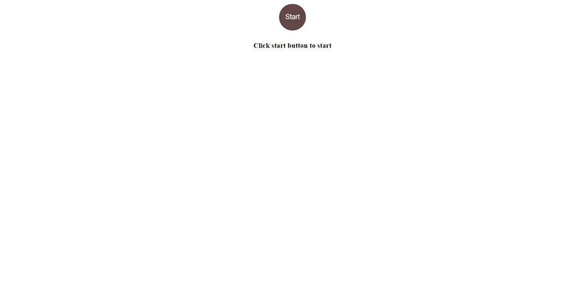

# Concentration Game in React

Concentration, also known as Match Match, Match Up, Memory, Pelmanism, Shinkei-suijaku, Pexeso or simply Pairs build using react js. Updated version from previous https://github.com/sareh-safuan/Match-The-Card. 

### `npm install`
### `npm start`

Runs the app in the development mode. 
Open [http://localhost:3000](http://localhost:3000) to view it in the browser.

License
----
MIT